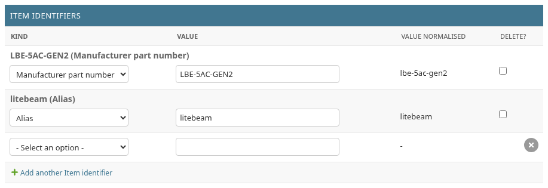
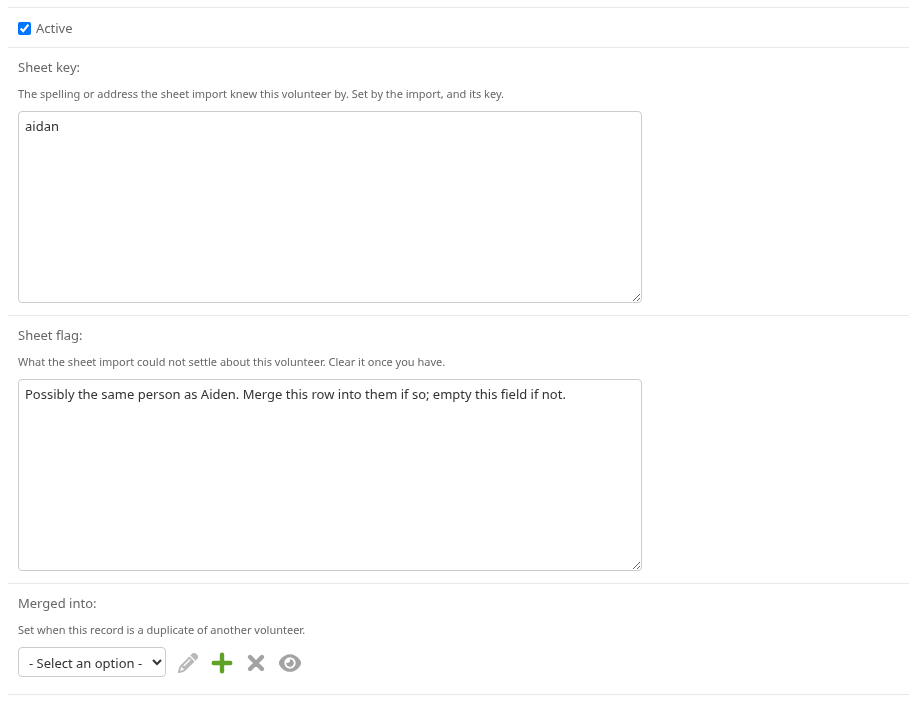
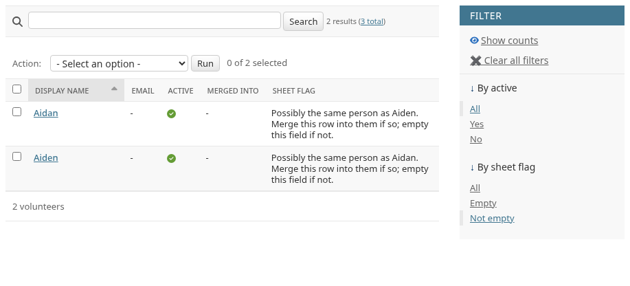
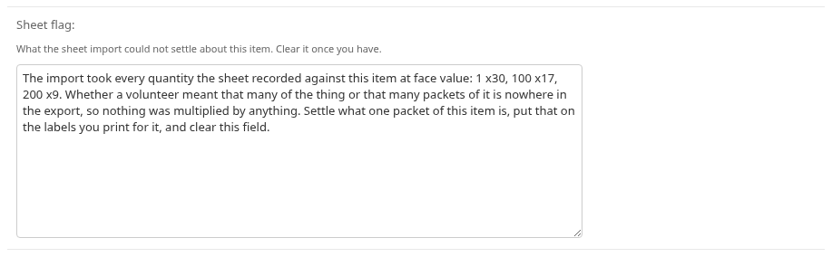
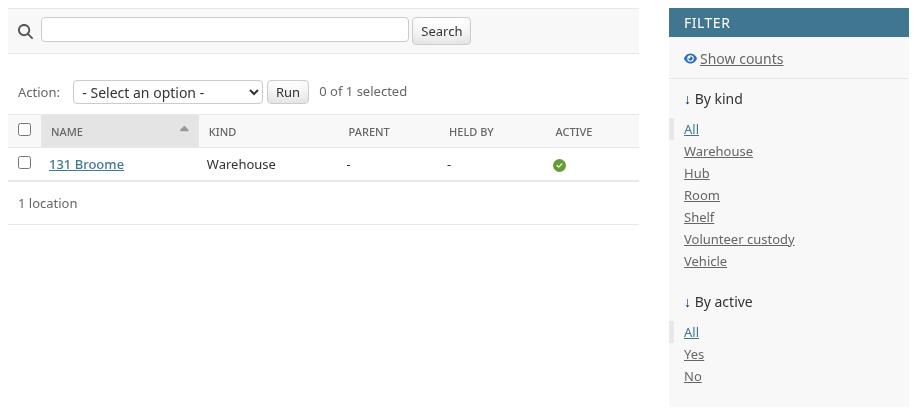
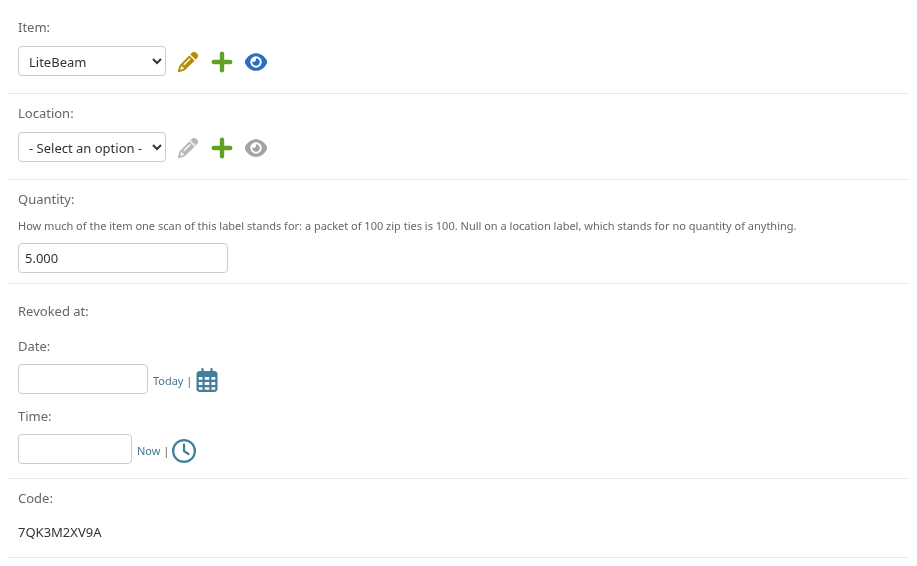
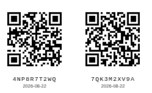
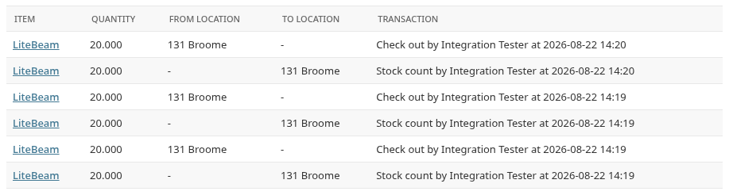

# Looking after the inventory

For the handful of people who keep the catalogue, the people list and the
labels in order. Everything here needs a login; volunteers need
[the other guide](volunteer.md).

What each record means is [the data model](../docs/data-model.md). This says
what to do, and where.

---

## Where you work

Two places, and they are one system.

- *The app itself*, for anything you are already looking at. An item row
  carries an **Edit** button for you and for nobody else, and the item list
  carries **Add an item** above it. Adding one asks for a name and a category,
  because an item has to be in one; the rest can be corrected afterwards from
  the same **Edit**.

  The two small lists an item and a batch choose from are made in the same
  places they are chosen. Inside **Add an item**, under the category box, is
  **New category** — and, once one is chosen, a way to rename it. On the
  batch's *Where the stock is* box is **New place**, and beside it a way to
  edit the one you picked. Neither offers a delete, because the API has none:
  a place stops being offered by clearing **Offered in the pick-list**, and a
  grouping cannot be removed from the app at all. Two things stay in the admin
  below: making a *volunteer custody* place, which needs a person named on it,
  and changing what kind of place an existing one is.
- *Django's admin*, at `/admin/`, for everything else. Almost every kind of
  record this system stores has a page there. The one that does not is the one
  the last section is about: how much of an item is on a particular shelf.

Sign in at `/accounts/login/` with the *username* the account was made under —
not the email address you know yourself by. A password sign-in then asks for a
code from an authenticator app as well, every time, and there is no way round
it — [decision 0013](../docs/decisions/0013-administrator-sign-in.md) says why.

*Saving* anything under `/admin/` asks you to sign in again if it is more than
fifteen minutes since you last did — and **what you typed is not kept**. The
prompt comes before the save is even looked at; afterwards you are returned to
the same page, freshly loaded, with your edit gone. Reading never asks. So
before a long edit, save one small thing first to start the clock, or expect to
type it twice.

---

## The catalogue, and what an identifier is for

An item is the thing, never the stock of it. Its count is worked out and never
typed. Underneath it on its page are its identifiers.

**An identifier is any string that has ever meant this item**: a part number, a
vendor's code, one of the retired `NYCM-` codes, or simply what people call it.

**What that does today, and what it does not.** Typing `tp link` into the
search box on the item list here in the admin finds the item, because this page
searches identifiers as well as names. The volunteer's app does not: its search
reads item names and nothing else, and nothing there ever shows an identifier.
So an identifier helps you and whoever else works in the admin, and changes
nothing a volunteer standing at a shelf can see. That gap is
`inventory-tng-gz2`. Until it is closed, add the identifier *and* check that
the item's own name is one somebody would think to type.

Even so, this is the fix for the old spreadsheet, where a name that did not
match matched nothing at all and the movement was silently lost. So:

**When somebody's word for a thing finds nothing, add it as an identifier.** Do
not rename the item to match. Two strings can name one item; one string may
never name two, and the database enforces that.

**An identifier is corrected, never removed.** There is no Delete on one — not
on its own page, not in the list's menu, and not on the item's form, where the
row simply has no *Delete?* box. Everything a mistake here needs is a field you
can change on the identifier itself: it is on the wrong item, so change *Item*;
the string was mistyped, so change *Value*; it is the wrong sort of code, so
change *Kind*.

That is not tidiness. The string has to be unique across every identifier
there is — that is what makes a scan find exactly one item — so removing a row
*frees* it, and somebody can then put the same string on something else. The
barcode on the object goes on scanning and starts answering with the wrong
item, which is worse than answering with nothing. Correcting the row never
lets go of the string, and the history of what it used to say is kept.

---

## Volunteers, and merging duplicates

Volunteers add themselves, so duplicates happen. Merging them is ordinary work,
not a repair.

Open the duplicate — the one you want to stop seeing — and set **Merged into**
to the record you are keeping.

What that does, and does not do:

- The duplicate stops being offered to anybody, and stops being usable as the
  person a batch is recorded against.
- **Every movement it is already on stays exactly where it was.** The record of
  movements is never rewritten, so nothing is lost and nothing changes number.
- It is not final. Emptying **Merged into** again puts the duplicate back in
  the list, with everything it was on still on it.

Three things worth knowing before you do one:

- **Choose a survivor who has not themselves been merged.** The list you choose
  from offers everybody, merged records included, and picking one of those is
  refused by the database rather than by the form — what you get is a server
  error page with nothing useful on it. The volunteer list shows a *Merged
  into* column; check it first.
- **Check first whether the duplicate is holding stock of their own.** Merging
  or retiring somebody who still holds a location is refused everywhere else in
  this system and allowed here, and doing it leaves that location active, with
  stock in it, named after a person nobody is offered any more. The *Held by*
  column on the location list is where to look; move the stock before you
  merge.
- Settling one pair is three changes and not one — see the next section.

Retiring a record with **Active** is the other half: it takes somebody out of
the list without claiming they were somebody else. Use it for a volunteer who
has moved on.

### About the Delete button

There is a **Delete** button on this page, and on a location. **Do not use
it.** Use **Merged into** and **Active** instead: those are how a record is
taken out of use, and deleting is not the same thing.

**An item has no such button at all**, and nothing in the item list's menu
offers one either. An item leaves the catalogue by having **Active** cleared,
which is on the same form you are already looking at, and that is now the only
way out.

That is the end of an argument rather than a new rule. Every reference to an
item is a guard: a sticker, an identifier, a recorded price, a movement. The
button therefore refused for any item that had been catalogued, printed,
priced or moved — which the import made nearly all of them — and went through
without comment for the one case left, a row created a minute earlier by
mistake. A button that will not tell you which of those it is about to do is
worse on this page than on any other, because this is the page you are on when
the app has already refused you something.

Why each of those references is a guard is worth knowing, because it is the
same reasoning that stops a location going. A code is printed on a sticker
already on a shelf, cannot be worked out again, and scanning one whose row had
gone would find nothing, for ever. A barcode is printed on the object as surely
as a code is on a sticker — and a string freed by a delete can be typed against
a different item afterwards, which leaves the sticker on the shelf answering
with the wrong thing rather than with nothing. A purchase price is a series
meant to stay readable, with no object out in the world to notice its going.

A location a sticker points at refuses to be deleted for the first of those,
and the refusal is a guard rather than a permission.

**A label has no Delete button either**, for the same reason twice over. Its
code is on a sticker that is already on a shelf; it was picked at random rather
than worked out, so nothing can reconstruct it. Delete the row and the scan
finds nothing, for ever — and the code goes back into the pool the next print
run draws from, so the sticker on the wall can start answering with a different
item altogether. Put a date in **Revoked at** instead: that is the only way out,
and it is the one the app itself takes.

Nothing anywhere removes a movement, or the batch it was part of. That is the
database refusing rather than a screen declining, so there is no button behind a
warning and no setting that changes it — and there will be no "only if you
really know what you are doing" screen added later, and no command for one.
[Decision 0024](../docs/decisions/0024-no-hard-delete.md) is why that was
settled rather than left open. If you believe a row genuinely has to leave the
database, that is a conversation with whoever runs the server and not a thing to
look for here.

**And a refusal never says much.** Django reports one as a permissions
problem naming the *kind* of record in the way — "label", or "stock movement" —
and shows you none of them. The row is safe either way; the message simply does
not explain itself.

**And you cannot look them up either**, which is the part worth knowing before
you go hunting. The label list searches codes and nothing else, so there is no
way from here to ask which stickers name a given shelf. That gap is
`inventory-tng-3ez`. Until it is closed, the answer is the one thing that does
work: scan the sticker, or open its own link, and the app tells you what it
points at.

---

## The questions the sheet import could not answer

The import from the old Google Sheet never guesses. Where it could not decide
something it wrote the question onto the record and left it for you. There are
two such columns, one on a volunteer and one on an item, and **both are
answered by being emptied**.

Both lists carry the same filter for finding them, on the right-hand side:
*By sheet flag*, then *Not empty*.

### On a volunteer

Each says which other record it might be the same person as. Decide, then
either merge it as above, or leave the two as two people.

**Emptying the field is what marks it settled, and merging does not do it for
you.** Both rows of a pair carry a question of their own, so settling one pair
is three changes across two records: the merge, and the field emptied on each.
The duplicate takes the merge and its own emptying in one save; the survivor
has to be opened separately.

### On an item

Every item the import moved stock for carries one, and it says the same thing
each time: these are the quantities the sheet recorded, taken literally,
because nothing in the export says whether a volunteer meant that many things
or that many packets of them. Nothing was multiplied by anything.

Settling one means deciding what a packet of that item is, putting that number
on the labels you print for it, and emptying the field.

You cannot repair the historical rows by answering it. Nothing already recorded
can be rewritten. If the number on the shelf is wrong,
[record a count](#putting-a-wrong-number-right).

---

## Locations

Locations nest: a warehouse or a hub holds rooms, a room holds shelves. The
kinds on offer are the six in the picture — *Warehouse*, *Hub*, *Room*,
*Shelf*, *Volunteer custody* and *Vehicle* — and there is no other. A volunteer
carrying stock is a location too, with **Held by** naming them.

Retiring a location with **Active** stops it being offered. Stock can still be
taken out of a retired place, but nothing can be moved into one. That is the
way to close a shelf; deleting it is not, for the reason above.

---

## Labels

A label is a printed code pointing at one item, or at one place. The code means
nothing by itself, so renaming an item never breaks a sticker.

**To make one:** add a label. The **Code** box arrives with a code already
filled in — leave it alone unless you are recording a sticker that was printed
somewhere else. Once the label is saved the code can no longer be changed,
because by then it is on a shelf, and the page shows it as plain text instead
of a box. That is what the picture above is: a label that already exists.

Point the label at an **Item** *or* at a **Location**, never both. **Quantity**
arrives showing `1`. On an item label it is what one scan of that sticker
means, so put `100` on the sticker that goes on a packet of a hundred. On a
wall label, clear the box — the help text under it calls that *Null*, which
only means empty: a wall code stands for a place and for no amount of anything.

**To print them:** collect the codes and ask for a sheet, comma separated.

    /api/labels/sheet?code=7QK3M2XV9A,4NP8R7T2WQ

Collecting them is the awkward part. The label list can be searched by code and
by nothing else — not by item, not by shelf, not by when it was printed — so
"find the codes for this shelf" means sorting a column and reading them off by
eye. That is `inventory-tng-3ez`.

**A code that names nothing, or that has been revoked, is simply left off the
sheet.** Nothing says so. The only sign is the line at the top of the page
saying how many labels are on it, and that line is not printed — so count it
against the number of codes you asked for before you send the page to the
printer.

That page is laid out to be printed as it is. **Print it at 100%.** Anything
else shrinks the squares, and small squares are the first thing faded ink
destroys. Everything else that decides whether a sticker still scans after a
year in a basement is fixed for you and is not worth adjusting. The code is
printed in words underneath so a dead sticker is still a usable label, and the
date is there so a faded batch can be found and replaced as a set.

**To replace a faded sticker:** print a new label and set **Revoked at** on the
old one. Do not reprint the old code. A revoked sticker still scans, and the
volunteer scanning it is told to have the shelf reprinted — so nobody is
blocked while you get round to it.

---

## Stopping one phone

Nobody signs in to use the app, so a browser tells the server which browser it
is by carrying a name it was given the first time it loaded. You will never see
that happen and neither will a volunteer: nothing is typed and no screen
appears.

What it buys you is one thing, and it is on the *Devices* page in `/admin/`.
Each row is one browser, with the date it first appeared and the address it
appeared from; filling in *Revoked at* on one stops the server answering that
browser from its next request onwards, and the app then offers that person the
same silent start again rather than a locked door.

Reach for it when one phone is doing something odd — a stuck app repeating a
submission, a device somebody has lost. It is not a way to stop a *person*
doing anything: the same person on another browser is another row, and
[the deployment guide](../docs/deployment.md#cutting-off-a-device) is where the
larger levers are, including the one that clears every device at once.

## Reading a balance

**A balance is never stored.** It is arithmetic over the movements: everything
that arrived somewhere, less everything that left.

You read the number itself in the catalogue, on the item's row in the app —
that is the figure a volunteer sees, and it is everything on every shelf added
together.

**Per shelf, there is no screen anywhere.** The numbers are worked out and the
app uses them, but nothing in the admin has a page for them. Adding up the
movements for one place, by eye, is the only way to a per-shelf figure today.

You read *why* a total is what it is here, in the movements. When somebody
reports that a shelf disagrees with the app, this list is where the answer is —
with one thing to know before you go looking. It can be narrowed to a single
item, by the filter on the right, and searched by an item's name or a job
reference. It cannot be narrowed to a place. So "what has happened to this
shelf" means picking the item and then reading the two location columns down
the page.

Nothing here can be edited or deleted, by anybody, ever — the database itself
refuses.

### Putting a wrong number right

A wrong figure is not corrected. It is answered, by recording the difference as
a stock count, which sits on top of everything already there.

**A count is a difference, not a total.** If the shelf holds 12 and the app
says 9, the number to record is `3`. Recording `12` would make the app say 21,
and there is no undoing it.

The volunteer's app cannot do this — its **What is happening** menu deliberately
does not offer a count. It is done in the admin, under *Stock transactions* →
*Add stock transaction*:

- *Kind*: *Stock count*.
- *Actor*: you.
- *Reason*: what you counted, and when you counted it.
- Then one *Stock movement* row underneath for each item you counted. Put the
  difference — never the total, and always a positive number — in *Quantity*,
  and let the two location boxes carry the direction:
  - the shelf holds *more* than the app says: put the shelf in *To location*
    and leave *From location* empty;
  - the shelf holds *less*: put the shelf in *From location* and leave *To
    location* empty.

Save it once. The old rows stay exactly where they were, because nothing is
ever taken out, and the total now agrees with the shelf.

---

*Bold above is a button to press or a box to fill in. Italics are the screen's
own words.*
