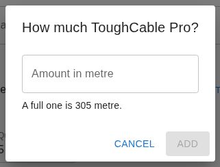

# Taking stock out, and bringing it back

For anyone moving hardware in or out of an NYC Mesh store. You need a phone or
a laptop and the address of the inventory app. Administrators have
[their own guide](administrator.md).

**The whole job is five taps:**

1. Type your name into **Who are you?**, then tap yourself in the list.
2. Scan the code on the wall. The app answers *Location set for this batch*.
3. Scan every label you are holding, or find each item in the list underneath.
4. Check **What is happening**. It opens on **Taking stock out**, so change it
   if you are bringing something back.
5. Press **Save**. Nothing is recorded until you do.

Everything below is one of those five not going to plan. [Being asked to sign
in](#if-the-app-asks-you-to-sign-in) and [the
camera](#if-the-camera-will-not-open) are at the bottom, out of the way.

---

## 1. Say who you are

Type your name into **Who are you?**. Tap yourself in the list underneath.

If nobody in the list is you, tap the button offering to add you — *Add Jo
Smith*, or *Not listed — add Jo Smith* when there are near misses above it.
Search first and add second, always: two spellings of one person is the mess
this app was built to end. Type an email address or a Slack ID and it asks for
your name as well, so the list shows a name and not an address.

The app then says *Working as* and your name, and remembers you on this device.
Tap **Not you?** to hand the phone to somebody else.

---

## 2. Say where the stock is

Scan the code stuck on the wall. The app answers *Location set for this batch*
— that line is the whole confirmation, and it needs doing once per batch.

No wall code? A **Where the stock is** list appears with the batch, once
something is in it. Either way does the same thing, and the last one wins.

Saving empties it again, so the next batch needs telling where it is too.

---

## 3. Scan what you are holding

Four ways in, and they all do the same thing:

- **Camera.** Tap **Camera** and point it at the label.
- **Scanner gun.** Point and pull the trigger. It types into the box for you.
- **Your fingers.** The characters printed under the QR are the code. Type them
  into **Scan or type a code** and press Enter. Do this when the ink has faded
  and nothing will read it.
- **The camera app your phone came with.** A sticker holds a web address, so
  pointing that at one opens this app on the item, before you have opened it
  yourself.

Every scan answers in a line on screen, with a beep and a buzz:

The number is what one scan of that sticker means. A sticker on a packet of a
hundred adds a hundred. Scan the same packet twice and the line goes up by two
packets — a second look, that is, not one 750-millisecond glimpse under a
camera, which reads the same square many times a second and counts once.

**Cable and anything else measured** does not go in until you say how much.

It opens empty on purpose — a full box and the last few metres of one look
identical on a shelf — and it tells you what a full one holds. Type what you
actually took and press **Add**. **Cancel** leaves it out of the batch entirely.

**A code the app does not know** is not a dead end. It says so and you find the
item in the list below instead.

**A sticker that has been replaced** still works. You are told to get the shelf
reprinted, and the scan counts.

### Or find it in the list

Everything is in the catalogue below the scanner. Search for it, then use the
buttons.

A row carries two numbers and they are not the same thing. *12 on hand* is
every shelf everywhere added together. The number between **−** and **+** is
how much of it is in *this* batch, and starts at nothing.

**−** and **+** move by one. The chips beside them are the packet sizes that
item is labelled in, so **+5** adds five in one tap. Type into **Quantity** to
say an exact amount. To take the line out of the batch again, press **−** down
to nothing, or type `0` — emptying the box does nothing at all, and the old
number reappears the moment you tap away.

---

## 4. Check the batch, then save

**What is happening** starts at **Taking stock out**, whether you scanned the
stickers or picked from the list, because that is what a printed sticker is
mostly scanned for. **Bringing something back is not the same gesture: change
this box before you save.** The four choices read **Taking stock out**,
**Bringing stock back**, **Receiving a delivery** and **Used on a job**. Nothing
refuses the wrong one, and it costs double: an armful brought back but recorded
as taken out leaves the shelf two armfuls short, and only an administrator's
stock count puts that right.

Read the lines. Each one spells out its amount in the item's own unit — five
each, not a bare five — so nothing is recorded that you did not look at.

Then **Save**. Nothing is recorded until you do, and everything in the batch is
recorded together.

If there is no Save button, the app is telling you what is still missing —
who you are, where the stock is, or anything at all in the batch.

---

## 5. When one line is wrong

Nothing is saved, and the complaint is written against the line it is about.

Those red words come straight from the server and are not written for you.
They can be blunt or technical. What matters is which line they sit under.

Fix that line and leave the rest alone. Its row in the catalogue above is
where you change it — search for the item again if it has scrolled away — then
retype the **Quantity**, or press **−** down to nothing to drop it. Then press
**Try again**. The other lines are still there and are still yours.

---

## 6. "Worth a stock count"

Your batch went in. Nothing is wrong with it.

What this says is that a shelf now reads below zero, so the app and the shelf
disagree. Almost always the shelf is right and something earlier went
unrecorded. You are not being blocked and you have nothing to undo. Go and
count what is actually there when you get a moment, and tell an administrator.

---

## 7. No signal

Stores are basements. If nothing answers when you save, the app keeps the batch
on the phone and hands the batch screen back empty, so you can carry on
scanning the next armful.

Anything still waiting sits at the top of the screen, in your way, until it is
recorded.

One line per batch, and the colour of the line is the whole message:

- **Blue, still waiting.** It goes on its own when the app is next opened, when
  the phone reports a network, and when a later save gets through. **Send now**
  tries again immediately. **Discard** throws that batch away, and it is
  recorded nowhere else.
- **Green, it landed** — even if you closed the tab and came back the next day.
  **Dismiss** clears the line.
- **Red, it was refused, and it will not be sent again.** This is the one to
  stop at. The stock is *not* recorded, nothing further will happen on its own,
  and **Discard** here throws away the only record of it that exists. Read what
  the line says, then scan the armful again from the shelf — nothing was
  recorded the first time, so there is nothing to double up. If what it says
  is not something you can put right, tell an administrator *before* you
  discard it.

Do not scan the same armful again just because you cannot see it on the batch
screen. A waiting batch is the same batch, and the app is careful not to record
it twice.

If the phone has no room to keep it, you are told so and the batch stays on the
screen in front of you instead. That is then the only copy: get a signal and
press **Try again** rather than walking away.

---

## If the app asks you to sign in

It may not. Some deployments let a volunteer scan and save with no account at
all, and if yours does, there is nothing on this page for you to do.

Where it does ask, that is a choice whoever runs it made, and the person who
set it up is who to ask for a login. It is not a step you are expected to work
around.

## If the camera will not open

Two different things go wrong here and they say different things.

**This browser is not letting the page use the camera.** The common one: the
permission prompt was dismissed, or refused once and remembered. The message
appears under the picture. Tap the padlock or the icon at the left of the
address bar, set the camera to allow, then tap **Camera** again.

**No camera is available here.** A camera only works on an `https://` address,
so reaching the app by a plain address on the network gives you no camera at
all. In that case there is no picture either — the message is all there is.

Meanwhile, type the code printed under the QR, or find the item in the list.
Neither needs a camera, and neither does the camera app your phone came with.

If the picture is too wide to focus on a small label, a **Camera** chooser
appears where the phone offers more than one lens. Pick another one.

---

*Bold above is something to press or type into. Italics are the app's own
words back to you.*
