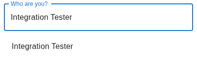
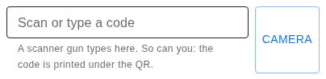
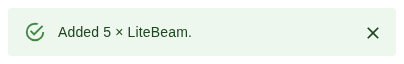
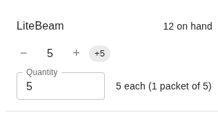
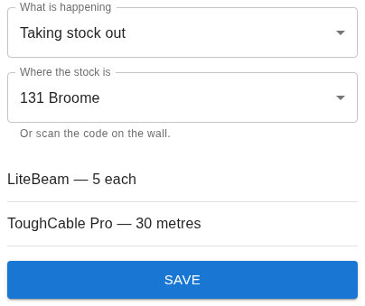
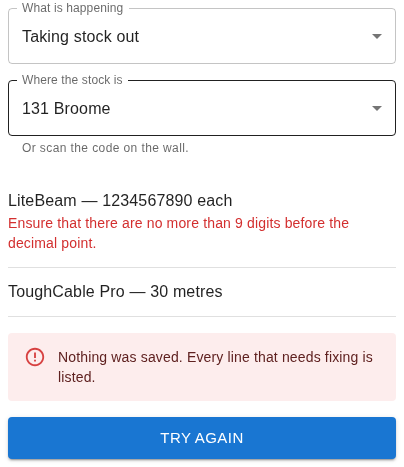
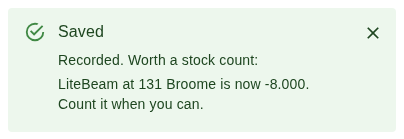
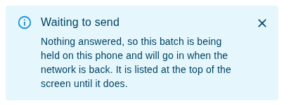
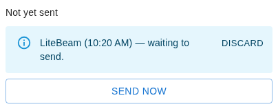

# Taking stock out, and bringing it back

For anyone moving hardware in or out of an NYC Mesh store. You need a phone or
a laptop and the address of the inventory app. Nothing here needs you to know
anything about the system.

Administrators have [their own guide](administrator.md).

---

## Before you start

Open the app. Today it asks everybody to sign in, volunteers included, so ask
an administrator for a login if you have none. That is a gap rather than a
plan; it is listed in
[what is not built yet](../docs/architecture.md#not-yet-built).

---

## 1. Say who you are

Type your name in the box at the top. Tap yourself in the list underneath.

If nobody in the list is you, tap the button offering to add you. Search first
and add second, always: two spellings of one person is the mess this app was
built to end. Type an email address or a Slack ID and it asks for your name as
well, so the list shows a name and not an address.

The app then says *Working as* and your name, and remembers you on this device.
Tap **Not you?** to hand the phone to somebody else.

---

## 2. Say where the stock is

Scan the code stuck on the wall. That tells the app which store you are
standing in, and it needs telling once per batch.

No wall code? A **Where the stock is** list appears with the batch, once
something is in it. Either way does the same thing, and the last one wins.

---

## 3. Scan what you are holding

Three ways in, and they all do the same thing:

- **Camera.** Tap **Camera** and point it at the label.
- **Scanner gun.** Point and pull the trigger. It types into the box for you.
- **Your fingers.** The characters printed under the QR are the code. Type them
  and press Enter. Do this when the ink has faded and nothing will read it.

Every scan answers in a line on screen, with a beep and a buzz:

The number is what one scan of that sticker means. A sticker on a packet of a
hundred adds a hundred. Scan the same packet twice and the line goes up by two
packets — a second look, that is, not the same half-second under a camera.

**Cable and anything else measured** does not go in until you say how much. A
box asks, and it tells you what a full one holds. Type what you actually took.

**A code the app does not know** is not a dead end. It says so and you find the
item in the list below instead.

**A sticker that has been replaced** still works. You are told to get the shelf
reprinted, and the scan counts.

### Or find it in the list

Everything is in the catalogue below the scanner, with what is on the shelf
beside it. Search for it, then use the buttons.

**−** and **+** move by one. The chips beside them are the packet sizes that
item is labelled in, so **+5** adds five in one tap. Type into **Quantity** to
say an exact amount. Take it to nothing and the line leaves the batch.

---

## 4. Check the batch, then save

**What is happening** starts at *Taking stock out*, whether you scanned the
stickers or picked from the list, because that is what a printed sticker is
mostly scanned for. **Bringing something back is not the same gesture: change
this box before you save.** The four choices are taking stock out, bringing it
back, receiving a delivery, and using it on a job.

Read the lines. Each one spells out its amount in the item's own unit — five
each, not a bare five — so nothing is recorded that you did not look at.

Then **Save**. Nothing is recorded until you do, and everything in the batch is
recorded together.

If there is no Save button, the app is telling you what is still missing —
who you are, where the stock is, or anything at all in the batch.

---

## 5. When one line is wrong

Nothing is saved, and the complaint is written against the line it is about.

Fix that line and leave the rest alone. Its row in the catalogue above is
where you change it: retype the **Quantity**, or press **−** down to nothing to
drop it. Then press **Try again**. The other lines are still there and are
still yours.

---

## 6. "Worth a stock count"

Your batch went in. Nothing is wrong with it.

What this says is that a shelf now reads below zero, so the app and the shelf
disagree. Almost always the shelf is right and something earlier went
unrecorded. You are not being blocked and you have nothing to undo. Go and
count what is actually there when you get a moment, and tell an administrator.

---

## 7. No signal

Stores are basements. If nothing answers when you save, the app keeps the batch
on the phone and hands the cart back empty, so you can carry on scanning the
next armful.

Anything still waiting sits at the top of the screen, in your way, until
the ledger has it.

- It goes on its own when the app is next opened, when the phone reports a
  network, and when a later save gets through.
- **Send now** tries again immediately.
- **Discard** throws that batch away. It is not recorded anywhere else.
- When it lands, the line turns green and says so — even if you closed the tab
  and came back the next day. **Dismiss** clears it.

Do not scan the same armful again because you cannot see it in the cart. The
held batch is the same batch, and the app is careful not to record it twice.

---

## 8. If the camera will not open

The app says why, under where the picture would be. The usual cause is the
address: a camera only works on an `https://` address, so reaching the app by a
plain address on the network gives you no camera at all.

Meanwhile, type the code printed under the QR, or find the item in the list.
Neither of them needs a camera.

If the picture is too wide to focus on a small label, a **Camera** chooser
appears where the phone offers more than one lens. Pick another one.

---

*A control's name is set in bold above. Those short phrases are the app's own
buttons and boxes, and a test drives the app on every push and fails if one of
them has been renamed away — [what CI proves](../DEVELOPERS.md#what-ci-proves).*
